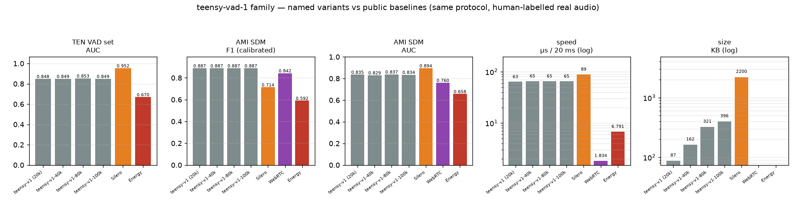

# teensy-vad-1 — a VAD small enough to understand

The first model of the **teensyvad** family: a complete voice activity
detector in **20,449 parameters (87 KB)**, written in pure numpy with
hand-written backprop — built to learn how VAD works and to run in an
Asterisk telephony stack.

**Telephony-native**: 8 kHz, 16-bit mono — exactly what a phone call is.
No resampling anywhere (PSTN / G.711 / Asterisk `slin` are all 8 kHz).

## Quick Start

```python
from teensyvad import OfflineVAD

# Standalone VAD — auto-downloads from the Hub (pip install huggingface_hub)
model = OfflineVAD("Teensy/teensy-vad-1")
result = model.segments("long_audio.wav")
# Returns speech segments: [[start_ms, end_ms], [start_ms, end_ms], ...]
print(result)                    # e.g. [[90, 5150]] — the fsmn-vad convention
```

Variant selection: `OfflineVAD("Teensy/teensy-vad-1", model_file="teensy-v1-80k.npz")`
(see the variant table below).  Local use without the hub: pass a
`.npz` path.  `teensyvad` is pure numpy (single package dir in the
project repo) — the only dependency.

## Use as Part of an ASR Pipeline

```python
from teensyvad import OfflineVAD
from teensyvad.audio import write_wav

vad = OfflineVAD("Teensy/teensy-vad-1")
segments = vad.segments("meeting_2hours.wav")     # [[start_ms, end_ms], ...]

for i, (start_ms, end_ms) in enumerate(segments):
    seg = vad.slice("meeting_2hours.wav", start_ms, end_ms)  # float32 @ 8 kHz
    write_wav(f"speech_{i}.wav", seg, 8000)
    # text = my_asr.transcribe(f"speech_{i}.wav")  # <- your ASR here
```

Streaming / telephony (Asterisk AudioSocket): `from teensyvad import
StreamingVAD` — feed 20 ms PCM16LE frames, get `speech_start` /
`speech_end` events, `vad.speech_seconds` for talk time; a working
server ships as `scripts/audiosocket_server.py` in the project repo.

## Architecture

| | |
|---|---|
| Model | 3-layer MLP, 400 → 48 → 24 → 1 (ReLU, sigmoid head) |
| Parameters | 20,449 (87 KB float32) |
| Input | 10 frames × (20 log-mel + 20 Δ) = 400 dims (100 ms context) |
| Output | P(speech) per 10 ms frame |
| Framing | 25 ms window / 10 ms hop @ 8 kHz |
| Speed | ~14 µs/frame numpy single, 0.27 µs batched; 6.6 µs ONNX single |

### Exact feature specification (reimplementable)

1. Mono float32 8 kHz, frames of 200 samples (25 ms), hop 80 (10 ms).
2. Per frame: Hann window → zero-padded FFT to 256 → power spectrum.
3. 20 mel triangles over 80–3800 Hz (rows normalised to sum 1).
4. `log(mel + 1e-10)`, then **subtract per-frame mean over bands**
   (gain invariance — the model sees spectral *shape*, not level).
5. First-order delta (current − previous), concatenate → 40 dims/frame.
6. Stack 10 frames (oldest→newest, frame-major), standardise with the
   `in_mean` / `in_std` vectors stored in the `.npz`.

## What's in this repo

| file | what |
|---|---|
| `teensy-v1.npz` | float32 weights + norm stats + JSON metadata (thresholds, feature config) |
| `teensy-v1.onnx` | same model as ONNX (input normalisation folded in; raw 400-d features in, logit out) |
| `teensy-v1-int8.onnx` | dynamic int8 ONNX (22 KB) |

Minimal numpy inference:

```python
import numpy as np, json
z = np.load("teensy-v1.npz")
meta = json.loads(str(z["meta"]))            # thresholds + feature config
def score(x):                                 # x: standardised 400-dim window
    h1 = np.maximum(x @ z["p/W1"] + z["p/b1"], 0)
    h2 = np.maximum(h1 @ z["p/W2"] + z["p/b2"], 0)
    return 1 / (1 + np.exp(-(h2 @ z["p/W3"] + z["p/b3"])))   # P(speech)
```

For streaming (chunk-in → `speech_start`/`speech_end` events out, with
hysteresis + hangover) use the teensyvad source that accompanies this
model family.

## Training

* Speech: LibriSpeech `dev-clean` (1,200 utterances, speaker-disjoint splits)
* Noise: ESC-50 (fold-disjoint; human-vocal categories excluded)
* Mixing: SNR 0–20 dB, 40 % of clips round-tripped through G.711 µ-law
  (realistic telephone degradation)
* Labels: **construction ground truth** — a frame is speech iff the
  placed utterance covers its centre (utterance edges energy-trimmed)

## Measured quality

| benchmark | frame F1 | AUC |
|---|---|---|
| synthetic test (unseen speakers, unseen noise) | 0.903 | 0.889 |
| event-level streaming (120 clips) | 0.976 | — |
| TEN VAD public set (real recordings) | 0.850 | 0.848 |
| AMI SDM meetings (real rooms, manual labels) | 0.743 | 0.835 |

The energy-baseline comparison that motivated this model: on the same
streamed clips an adaptive energy VAD reaches event F1 0.535 (2.5×
over-triggering) vs 0.976 here.

## Limitations (honest)

* English read-speech + environmental noise only; music and multi-talker
  babble were **not** in training (see `teensy-vad-3` for those).
* Labels include intra-utterance pauses marked "speech" — boundaries are
  loose (onset ~430 ms early vs a Silero teacher). `teensy-vad-2` fixes
  this via distillation.
* Operating thresholds stored in metadata were tuned on synthetic
  validation; real-domain thresholds differ (see v3's profiles).

## Models in this repository (named variants)

All variants share the architecture and training recipe of this card —
they differ only in hidden-layer size (88/48, 164/88, 200/96) and were
trained to map the capacity/accuracy trade-off:

| name | file | params | KB | role |
|---|---|---|---|---|
| **teensy-v1** | `teensy-v1.npz` | 20,449 | 87 | the original — family sweet spot |
| teensy-v1-40k | `teensy-v1-40k.npz` | 39,609 | 162 | capacity probe |
| teensy-v1-80k | `teensy-v1-80k.npz` | 80,373 | 321 | capacity probe (family's best AUCs) |
| teensy-v1-100k | `teensy-v1-100k.npz` | 99,593 | 396 | capacity probe |

ONNX exports (float32 + dynamic int8) are provided for the 20k model.

### Accuracy & speed of every variant



(Measured on the shared protocol — TEN VAD public set + AMI SDM meetings,
human labels, AMI-dev-calibrated operating points, AUC on raw
probabilities; see [BENCHMARKS.md](https://huggingface.co/Teensy/teensy-vad-3/blob/main/BENCHMARKS.md).
Note accuracy is flat across sizes: the 1M-frame training set saturates
first — scaling capacity without scaling data buys nothing here.)

## Comparison vs Energy / WebRTC / Silero

Same protocol for every system, human-labelled real audio, operating
points calibrated on held-out AMI dev meetings (full appendix with
charts and per-size results: [teensy-vad-3/BENCHMARKS.md](https://huggingface.co/Teensy/teensy-vad-3/blob/main/BENCHMARKS.md)):

| | teensy-v1 | Silero VAD | WebRTC VAD | Energy VAD |
|---|---|---|---|---|
| params | 20,449 | 1,774,000 | ~6k (C) | — |
| TEN VAD set — AUC | 0.848 | **0.952** | n/a | 0.670 |
| AMI SDM — F1 (calibrated) | 0.887 | 0.714 | 0.842 | 0.592 |
| AMI SDM — AUC | 0.835 | **0.894** | 0.760 | 0.658 |
| µs / 20 ms chunk | 63 | 89 | **2** | 7 |

Capacity note: this family was also trained at 40k/80k/100k params
(files `teensy-v1-{40k,80k,100k}.npz`) — accuracy is **flat** across
sizes because the 1M-frame training set saturates first; more parameters
need more data (demonstrated by the v3 family). Silero ranks best by AUC
(87× larger); its stock threshold misses 44 % of room speech — every
calibrated teensy model beats it on AMI F1.

## License & data

Code: MIT. Weights: **CC BY-NC-SA 4.0** (training noise ESC-50 is
CC BY-NC-SA 3.0; speech LibriSpeech CC BY 4.0). Not for commercial
deployment without replacing the ESC-50-derived training data.
