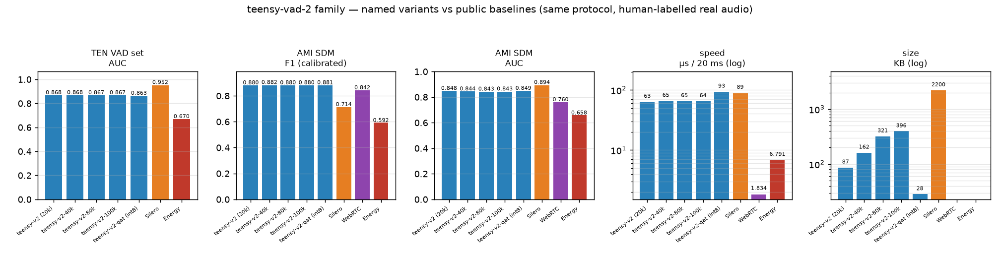

# teensy-vad-2 — distilled from Silero VAD

Same tiny architecture as [teensy-vad-1](https://huggingface.co/Teensy/teensy-vad-1)
(20,449 params, 87 KB, pure numpy), but trained on **Silero VAD teacher
labels** instead of construction labels — knowledge distillation from a
~2M-parameter teacher into a 20k-parameter student.

**Why**: construction labels know *where the utterance was placed*, not
where speech actually starts and stops. Silero relabelled every frame of
the training mixtures (soft probabilities, interpolated to the 10 ms
grid); the teacher disagreed with construction labels on 11.6 % of
frames — 9.2 % were pauses/breathy tails mislabelled "speech". The
student learned where speech *actually* is:

| boundary quality (vs Silero teacher, 100 streamed clips) | v1 | **v2** |
|---|---|---|
| onset Δ | −432 ms | **−172 ms** |
| offset Δ | +718 ms | **+478 ms** |

## Architecture

Identical to v1 (see its card for the exact, reimplementable feature
spec): 400→48→24→1 MLP over 10 frames of 20 log-mel+Δ at 8 kHz.

## What's in this repo

| file | what |
|---|---|
| `teensy-v2.npz` | float32 model (hard teacher labels) — the default v2 |
| `teensy-v2-qat.npz` | QAT int8 version (28 KB, decision agreement 96 % with float) |
| `teensy-v2.onnx` | float32 ONNX export |
| `teensy-v2-int8.onnx` | dynamic int8 ONNX (22 KB, 0.067 µs/frame batched) |

## Training

* Same mixtures as v1 (LibriSpeech dev-clean + ESC-50, 0–20 dB SNR,
  µ-law augmentation), **labels from Silero VAD run at 8 kHz**
* Two students trained: hard 0/1 labels (this model) and soft
  probabilities (slightly higher AUC 0.929 vs 0.922 on val; the hard
  variant produced tighter event boundaries and is the default)
* Event thresholds calibrated at event level on validation

## Measured quality

| benchmark | frame F1 | AUC |
|---|---|---|
| synthetic test (vs teacher labels) | 0.905 | 0.923 |
| TEN VAD public set (stored thr) | 0.869 | 0.868 |
| TEN VAD public set (best thr, upper bound) | 0.890 | — |
| AMI SDM meetings (AMI-calibrated thr) | 0.880 | 0.848 |

Teacher (Silero) on the same real sets for scale: TEN F1 0.937 / AUC
0.863; AMI F1 0.714 / AUC 0.772 — the student already out-ranks its
teacher on AMI (real rooms) while the teacher stays better calibrated
close-mic.

## Quantization

PTQ is essentially free on this model (ΔAUC 0.0000, 99.7 % decision
agreement); QAT adds +0.9 F1 points over PTQ at identical size. In pure
numpy int8 is a *size* play (~3× smaller) not a speed play — for speed
use the ONNX int8 file (real int8 kernels, 0.067 µs/frame batched).

## Limitations (honest)

* A student inherits its teacher's biases — Silero's conservatism on
  sung/tone-like audio transfers.
* English read speech + environmental noise; no babble or room tone
  (see [teensy-vad-3](https://huggingface.co/Teensy/teensy-vad-3)).
* Operating thresholds are domain-specific: v2's real-set numbers above
  used AMI-calibrated thresholds (0.10); the stored default suits
  synthetic-event use.

## Models in this repository (named variants)

All variants share the architecture and distillation recipe of this
card — float variants differ only in hidden-layer size (88/48, 164/88,
200/96); the QAT variant is the 20k net fine-tuned under int8 simulation:

| name | file | params | KB | role |
|---|---|---|---|---|
| **teensy-v2** | `teensy-v2.npz` | 20,449 | 87 | the default — distilled 20k, tightest boundaries |
| teensy-v2-40k | `teensy-v2-40k.npz` | 39,609 | 162 | capacity probe |
| teensy-v2-80k | `teensy-v2-80k.npz` | 80,373 | 321 | capacity probe |
| teensy-v2-100k | `teensy-v2-100k.npz` | 99,593 | 396 | capacity probe |
| teensy-v2-qat | `teensy-v2-qat.npz` | 20,449 | **28** | int8 QAT — smallest accurate artifact |

ONNX exports (float32 + dynamic int8) are provided for the 20k model.

### Accuracy & speed of every variant

(Measured on the shared protocol — TEN VAD public set + AMI SDM meetings,
human labels, AMI-dev-calibrated operating points, AUC on raw
probabilities; see [BENCHMARKS.md](https://huggingface.co/Teensy/teensy-vad-3/blob/main/BENCHMARKS.md).
Accuracy is flat from 20k→100k on the 1M-frame training set — the
distilled 20k is the family's sweet spot; scale data instead, see
[teensy-vad-3](https://huggingface.co/Teensy/teensy-vad-3).)

## Comparison vs Energy / WebRTC / Silero

Same protocol for every system, human-labelled real audio, operating
points calibrated on held-out AMI dev meetings (full appendix with
charts and per-size results: [teensy-vad-3/BENCHMARKS.md](https://huggingface.co/Teensy/teensy-vad-3/blob/main/BENCHMARKS.md)):

| | teensy-v2 | Silero VAD | WebRTC VAD | Energy VAD |
|---|---|---|---|---|
| params | 20,449 | 1,774,000 | ~6k (C) | — |
| TEN VAD set — F1 (best thr*) | 0.890 | **0.938** | n/a | — |
| TEN VAD set — AUC | 0.868 | **0.952** | n/a | 0.670 |
| AMI SDM — F1 (calibrated) | 0.880 | 0.714 | 0.842 | 0.592 |
| AMI SDM — AUC | 0.848 | **0.894** | 0.760 | 0.658 |
| µs / 20 ms chunk | 63 | 89 | **2** | 7 |

\* like-for-like with FlashVAD's published TEN numbers (also
threshold-tuned on that set): FlashVAD F1 0.889 / AUC 0.882 — teensy-v2
matches the F1 with 2.3× fewer parameters.

Capacity note: this family was also trained at 40k/80k/100k params
(`teensy-v2-{40k,80k,100k}.npz`) — like v1, accuracy is flat across
sizes on the 1M-frame training set. The distilled 20k model is the
family's sweet spot; scale the *data* instead (see
[teensy-vad-3](https://huggingface.co/Teensy/teensy-vad-3)).

## License & data

Code: MIT. Weights: **CC BY-NC-SA 4.0** (ESC-50 training noise is
CC BY-NC-SA 3.0; speech LibriSpeech CC BY 4.0; teacher Silero VAD is
MIT). Not for commercial deployment without retraining on
permissive noise data.
