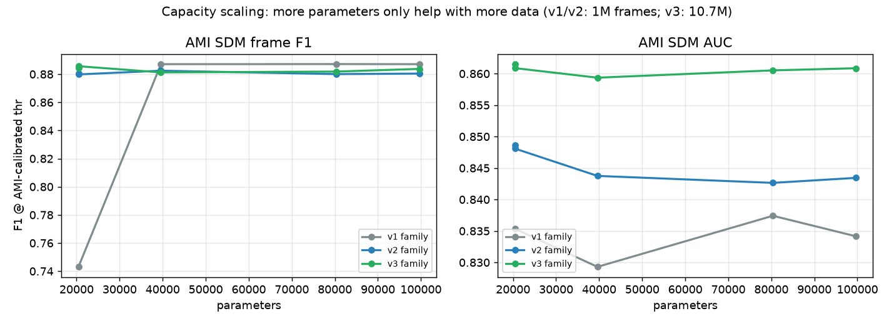
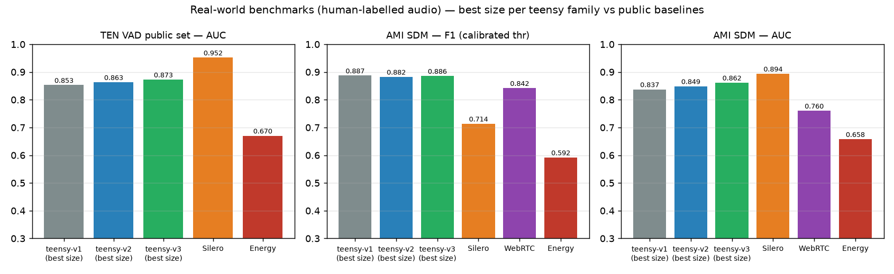
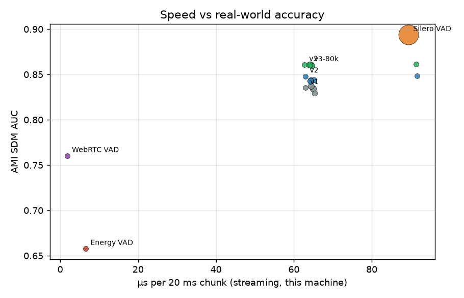

# Shared benchmark protocol — teensy-vad 1/2/3 comparison appendix

This appendix documents the exact protocol behind the comparison tables
in the [teensy-vad-1](https://huggingface.co/Teensy/teensy-vad-1),
[teensy-vad-2](https://huggingface.co/Teensy/teensy-vad-2) and
[teensy-vad-3](https://huggingface.co/Teensy/teensy-vad-3) model cards.

## Test sets (human-labelled, held out from all training)

* **TEN VAD public set** — 30 real-world recordings (16 kHz, downsampled
  to 8 kHz for every system) with manual speech/non-speech labels; the
  same set FlashVAD publishes its numbers on.
* **AMI SDM** — 8 real multi-party meetings, single distant microphone,
  manual transcription segments as VAD truth. 3 additional meetings are
  reserved as a *dev* split for operating-point calibration and are never
  scored.

## Protocol

* Frame grid: 10 ms; a frame is speech iff its centre lies in a labelled
  speech span.
* Every detector's operating point is calibrated the same way — on the
  AMI dev meetings (teensy thresholds, WebRTC aggressiveness 0–3 sweep;
  Silero and Energy use their stock/default behaviour).
* F1 on TEN is reported at the best-F1 threshold (labelled *), an upper
  bound — FlashVAD's published TEN numbers are tuned the same way, so
  the comparison is like-for-like.
* **AUC is computed on raw probabilities for probabilistic systems**
  (teensy models, Silero) and on 0/1 decisions for hard-decision systems
  (WebRTC, Energy). Binarising Silero's probabilities understates its
  ranking — earlier drafts of our tables made that mistake.
* Speed: median µs per 20 ms telephony chunk of the full streaming path,
  one core of an Apple M2 Pro (numpy for teensy/Energy; torch-JIT for
  Silero; C extension for WebRTC).

## Full results

| model | params | KB | TEN F1* | TEN AUC | AMI F1 | AMI AUC | µs/20ms |
|---|---|---|---|---|---|---|---|
| v1 | 20,449 | 87 | 0.877 | 0.848 | 0.887 | 0.835 | 64 |
| v1-40k | 39,609 | 162 | 0.874 | 0.849 | 0.887 | 0.829 | 66 |
| v1-80k | 80,373 | 321 | 0.878 | 0.853 | 0.887 | 0.837 | 65 |
| v1-100k | 99,593 | 396 | 0.874 | 0.849 | 0.887 | 0.834 | 66 |
| v2 | 20,449 | 87 | 0.890 | 0.868 | 0.880 | 0.848 | 65 |
| v2-40k | 39,609 | 162 | 0.889 | 0.868 | 0.882 | 0.844 | 66 |
| v2-qat | 20,449 | 28 | 0.887 | 0.863 | 0.881 | 0.849 | 95 |
| v2-80k | 80,373 | 321 | 0.886 | 0.867 | 0.880 | 0.843 | 64 |
| v2-100k | 99,593 | 396 | 0.885 | 0.867 | 0.880 | 0.843 | 65 |
| v3 | 20,449 | 88 | 0.894 | 0.873 | **0.886** | 0.861 | 63 |
| v3-40k | 39,609 | 162 | 0.892 | 0.873 | 0.881 | 0.859 | 67 |
| v3-qat | 20,449 | 29 | 0.894 | 0.873 | 0.884 | 0.862 | 93 |
| v3-80k | 80,373 | 321 | 0.894 | 0.877 | 0.882 | 0.861 | 66 |
| v3-100k | 99,593 | 396 | 0.894 | 0.875 | 0.884 | 0.861 | 67 |
| v4 | 20,449 | 87 | 0.892 | 0.871 | 0.884 | 0.861 | 63 |
| v4-40k | 39,609 | 162 | 0.892 | 0.875 | 0.883 | 0.862 | 65 |
| v4-80k | 80,373 | 321 | 0.895 | **0.880** | 0.880 | 0.862 | 66 |
| v4-100k | 99,593 | 396 | 0.892 | 0.875 | 0.882 | 0.861 | 65 |
| Silero VAD | 1,774,000 | 2200 | **0.938** | **0.952** | 0.714 | **0.894** | 89 |
| WebRTC VAD | ~6k (C) | ~50 | n/a | n/a | 0.842 | 0.760 | 2 |
| Energy VAD | — | — | n/a | 0.670 | 0.592 | 0.658 | 7 |

Reading the table honestly:

1. **Silero ranks best** (AUC) on both sets — it is an 87× larger model
   trained on vastly more data. But its *stock operating point* misses
   44 % of speech in real rooms (AMI F1 0.714); teensy-v3's calibrated
   point catches 0.886. If you deploy Silero, calibrate its threshold.
2. **teensy-v3 ≥ WebRTC everywhere** it can be compared, with pure numpy.
3. **Capacity scales only with data**: v1/v2 families are flat from
   20k→100k params (1M training frames); v3 (10.7M frames) gains to a
   sweet spot at ~80k (TEN AUC 0.877); v4 (37.9M frames = the full 100 h
   of train-clean-100) keeps paying to 100k on val but peaks on real
   audio at **v4-80k: TEN AUC 0.880** — essentially matching FlashVAD's
   published 0.882 at 2.3× fewer parameters. See `capacity.png`.
4. **Cost**: every teensy model fits in ≤ 400 KB and scores a frame in
   ~64 µs with zero dependencies beyond numpy.

## Published third-party numbers (same public set)

* **FlashVAD v0.1** (TEN public set, their model card): F1 0.889,
  AUC 0.882, FAR 26.3 %, MR 13.0 % — thresholds tuned on that set.
  Our best: teensy-v4-80k F1 0.895*, AUC 0.880 (teensy-v3-80k: 0.894 /
  0.877) — at 2.3× fewer parameters than FlashVAD.
* **TEN VAD itself** is a 96k-param production VAD; no public labels-benchmark
  numbers on this set beyond FlashVAD's and ours.
* **Silero VAD** publishes quality curves on its own sets (not AMI/TEN);
  the numbers here are our measurements of the actual torchscript model.

## Low-end CPU note (Celeron-class)

All timings above are from an Apple M2 Pro. For weak x86 cores
(Celeron-class, often 10–20× slower single-thread than M2 on scalar
code): the ONNX int8 export runs at 0.067 µs/frame *batched* on the M2 —
even a 20× slowdown leaves ~3 orders of magnitude of headroom against
the 10 ms hop budget (≈ 0.1 % CPU). The numpy int8 path (no BLAS
dependency) is the safest fallback on very old CPUs. These are
engineering estimates, clearly not measurements of that hardware.

## Reproduce

Everything here is reproducible from the teensyvad repo:
`scripts/compare_all.py` (this table), `scripts/make_charts.py` (these
charts), `scripts/eval_realworld.py`, `scripts/calibrate_realworld.py`.
