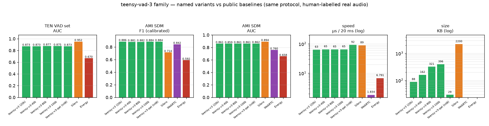

# teensy-vad-3 — scaled data, real-world hardened

The best model of the **teensyvad** family: **the same 20,449-parameter
architecture** as [v1](https://huggingface.co/Teensy/teensy-vad-1) and
[v2](https://huggingface.co/Teensy/teensy-vad-2), trained on 10× more
and much harder data — and evaluated on human-labelled real recordings.

**Headline**: at its AMI-calibrated operating point this 87 KB student
scores **AMI F1 0.886 vs Silero's 0.714** (Silero's stock threshold
misses 44 % of speech in real rooms), and **beats WebRTC VAD on every
metric** — at 1/20th the size of the Silero model. On ranking quality
(AUC, computed on raw probabilities for every system) Silero remains
ahead (see the comparison below) — the honest split is: *Silero ranks
best; teensy-v3 operates best in rooms, per KB and per µs.*

| real-world benchmark | v1 | v2 | **v3** | Silero (teacher) |
|---|---|---|---|---|
| TEN VAD public set — AUC | 0.848 | 0.868 | **0.873** | 0.952 |
| AMI SDM meetings — AUC | 0.835 | 0.848 | 0.861 | **0.894** |
| AMI SDM meetings — F1 (calibrated) | 0.887 | 0.880 | **0.886** | 0.714 |

(FlashVAD v0.1, for reference, publishes F1 0.889 / AUC 0.882 on the
TEN set — threshold-tuned on that set, as is our 0.894 best-threshold
number: parity within caveats, at 2.3× fewer parameters.)

## Training (what changed vs v2)

* **Speech**: 8,000 utterances from LibriSpeech `train-clean-100`
  (~30 h of mixtures, 10.7M teacher-labelled frames — 10× v2)
* **Noise, three families**:
  * ESC-50 environmental (as before, fold-disjoint)
  * **synthetic 7-talker babble** — summed disjoint LibriSpeech
    speakers; the classic hard case for VAD (background conversations)
  * **real AMI room ambience** — non-speech stretches of distant-mic
    meeting audio (chairs, keyboards, HVAC), taken **only** from the 3
    meetings reserved for calibration (the 8 evaluation meetings were
    never seen)
* **SNR −5 … 20 dB** (down from 0 dB floor)
* Labels: Silero teacher (as in v2), µ-law augmentation kept (G.711
  round-trip shifts real-set numbers by < 0.5 %)
* Lazy context-window training (`LazyWindows` — the full design matrix
  would be 17 GB; windows materialise per batch)

## What's in this repo

| file | what |
|---|---|
| `teensy-v3.npz` | float32 model — default |
| `teensy-v3-qat.npz` | QAT int8 version (28 KB; int8 val F1 0.912) |
| `teensy-v3.onnx` | float32 ONNX export |
| `teensy-v3-int8.onnx` | dynamic int8 ONNX (22 KB) |

Architecture and the exact reimplementable feature spec are identical to
[v1's card](https://huggingface.co/Teensy/teensy-vad-1): 8 kHz, 25/10 ms
framing, 20 log-mel + Δ with per-frame band-mean subtraction, 10-frame
context, 400→48→24→1 MLP.

## Domain threshold profiles (important)

Rankings transfer across domains; **operating points do not**. Best
threshold measured: ~0.45 close-mic/telephony, 0.10 distant-room,
0.85 synthetic-events. The `.npz` metadata therefore ships **profiles**:

```json
{"profiles": {
   "close_mic":    {"thr_hi": 0.45, "thr_lo": 0.27},   // default (telephony)
   "distant_room": {"thr_hi": 0.10, "thr_lo": 0.06}}}  // AMI-calibrated
```

`distant_room` was calibrated on 3 held-out AMI meetings; the 8
evaluation meetings were never used for any tuning.

## Limitations (honest)

* At distant-room operating points everyone's false-alarm rate is high
  on overlapped meeting speech (labels mark foreground speech only).
* English speech; no music in training (a known gap — music reads as
  "activity").
* 100 ms context is short: unvoiced fricatives in noise remain the
  hardest frames; a GRU/TCN would help (deliberately out of scope —
  this family stays a readable MLP).
* µ-law/PSTN robustness verified; packet-loss concealment not modelled.

## Models in this repository (named variants)

All variants share the 10.7M-frame scaled training recipe of this card —
float variants differ only in hidden-layer size (88/48, 164/88, 200/96);
the QAT variant is the 20k net fine-tuned under int8 simulation:

| name | file | params | KB | role |
|---|---|---|---|---|
| **teensy-v3** | `teensy-v3.npz` | 20,449 | 88 | the default — best AMI F1 of the family |
| teensy-v3-40k | `teensy-v3-40k.npz` | 39,609 | 162 | capacity step |
| **teensy-v3-80k** | `teensy-v3-80k.npz` | 80,373 | 321 | **family accuracy champion** (best TEN F1/AUC) |
| teensy-v3-100k | `teensy-v3-100k.npz` | 99,593 | 396 | capacity ceiling — saturating |
| teensy-v3-qat | `teensy-v3-qat.npz` | 20,449 | **29** | int8 QAT — smallest near-parity artifact |

ONNX exports (float32 + dynamic int8) are provided for the 20k model.

### Accuracy & speed of every variant



Unlike the v1/v2 families (flat 20k→100k on 1M frames), this family's
10.7M-frame training set lets capacity pay: TEN AUC rises 0.873 (20k)
→ **0.877 (80k)** before saturating at 100k. Full cross-family story
in [BENCHMARKS.md](BENCHMARKS.md) (`capacity.png`).

## Comparison vs Energy / WebRTC / Silero — and capacity scaling

Full protocol, charts and the complete 14-model table live in
[BENCHMARKS.md](BENCHMARKS.md) (same protocol for every system,
human-labelled audio, AMI-dev-calibrated operating points, AUC on raw
probabilities). Summary:

| | teensy-v3 (20k) | teensy-v3-80k | Silero VAD | WebRTC VAD | Energy VAD |
|---|---|---|---|---|---|
| params | 20,449 | 80,373 | 1,774,000 | ~6k (C) | — |
| TEN VAD set — F1 (best thr*) | 0.894 | **0.894** | 0.938 | n/a | — |
| TEN VAD set — AUC | 0.873 | **0.877** | 0.952 | n/a | 0.670 |
| AMI SDM — F1 (calibrated) | **0.886** | 0.882 | 0.714 | 0.842 | 0.592 |
| AMI SDM — AUC | 0.861 | 0.861 | **0.894** | 0.760 | 0.658 |
| µs / 20 ms chunk | 63 | 64 | 89 | **2** | 7 |

\* tuned on that set — like-for-like with FlashVAD's published
F1 0.889 / AUC 0.882.

This family was trained at 20k/40k/80k/100k params on the same 10.7M
frames (`teensy-v3-{40k,80k,100k}.npz`): capacity pays here up to a
**sweet spot at ~80k** (TEN AUC 0.873 → 0.877) then saturates — while
the v1/v2 families (1M frames) are flat from 20k. Capacity scales only
with data. See `capacity.png` in BENCHMARKS.md.

## License & data

Code: MIT. Weights: **CC BY-NC-SA 4.0** (ESC-50 CC BY-NC-SA 3.0 noise
in training; LibriSpeech CC BY 4.0; AMI CC BY 4.0; Silero teacher MIT).
Not for commercial deployment without replacing non-commercial training
data.
