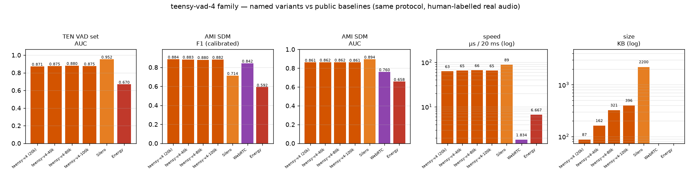

# teensy-vad-v4 — the 100-hour family

The fourth generation of the **teensyvad** family: the same readable
3-layer MLP, now trained on the **full ~100 h of LibriSpeech
train-clean-100** (all 28,539 utterances — 3.5× the v3 dataset,
**37.9M teacher-labelled frames**), with the complete 20k/40k/80k/100k
capacity sweep.

This card is the home of the family; every named size variant lives in
this repository.

## Why 100 hours

The v3 experiment showed capacity only pays when data scales with it:
on 1M frames, 20k→100k params was flat; on 10.7M frames the sweet spot
moved to ~80k. v4 completes the curve at 37.9M frames — and this time
capacity keeps paying to the largest size tested:

| size | val F1 | val AUC | training frames |
|---|---|---|---|
| teensy-v4 (20k) | 0.9137 | 0.9338 | 37.9M |
| teensy-v4-40k | 0.9179 | 0.9398 | 37.9M |
| teensy-v4-80k | 0.9199 | 0.9417 | 37.9M |
| **teensy-v4-100k** | **0.9205** | **0.9420** | 37.9M |
| *(reference: v3-80k)* | *(0.9165)* | *(0.9373)* | *(10.7M)* |

Real-world results (TEN VAD public set + AMI SDM, human labels) are in
the comparison section below; the shared protocol lives in
[BENCHMARKS.md](https://huggingface.co/Teensy/teensy-vad-3/blob/main/BENCHMARKS.md).

## Models in this repository (named variants)

| name | file | params | KB | role |
|---|---|---|---|---|
| **teensy-v4** | `teensy-v4.npz` | 20,449 | 87 | the default |
| teensy-v4-40k | `teensy-v4-40k.npz` | 39,609 | 161 | capacity step |
| teensy-v4-80k | `teensy-v4-80k.npz` | 80,373 | 321 | capacity step |
| teensy-v4-100k | `teensy-v4-100k.npz` | 99,593 | 396 | capacity ceiling |

## Training

* Speech: **all 28,539 utterances** of LibriSpeech train-clean-100
  (~100 h of mixtures; 37,936,872 frames — every window verified from
  the memmap at load: `train 37,936,863 windows`)
* Noise: ESC-50 + synthetic 7-talker babble + real AMI room ambience
  (calibration meetings only), SNR −5 … 20 dB, G.711 µ-law augmentation
* Labels: Silero teacher (hard), memmap/float16 training plumbing (the
  design matrix would be 60 GB if materialised)
* Architecture identical to
  [teensy-vad-1](https://huggingface.co/Teensy/teensy-vad-1) — see its
  card for the exact reimplementable feature spec.

## Comparison vs Silero / WebRTC / Energy — and prior families

Shared protocol (human-labelled audio, AMI-dev-calibrated operating
points, AUC on raw probabilities — full appendix:
[BENCHMARKS.md](https://huggingface.co/Teensy/teensy-vad-3/blob/main/BENCHMARKS.md)):

| | v4 (20k) | **v4-80k** | v3-80k | Silero | WebRTC | Energy |
|---|---|---|---|---|---|---|
| params | 20,449 | 80,373 | 80,373 | 1,774,000 | ~6k | — |
| TEN VAD set — F1 (best thr*) | 0.892 | **0.896** | 0.894 | 0.938 | n/a | — |
| TEN VAD set — AUC | 0.871 | **0.880** | 0.877 | 0.952 | n/a | 0.670 |
| AMI SDM — F1 (calibrated) | **0.884** | 0.880 | 0.882 | 0.714 | 0.842 | 0.592 |
| AMI SDM — AUC | 0.861 | **0.862** | 0.861 | 0.894 | 0.760 | 0.658 |
| µs / 20 ms chunk | 63 | 66 | 66 | 89 | 2 | 7 |

\* tuned on that set — like-for-like with FlashVAD's published
F1 0.889 / AUC 0.882: **v4-80k essentially matches FlashVAD's AUC
(0.880 vs 0.882) at 2.3× fewer parameters**, and leads every prior
teensy family on TEN AUC.

## License & data

Code: MIT. Weights: **CC BY-NC-SA 4.0** (ESC-50 CC BY-NC-SA 3.0 noise
in training; LibriSpeech CC BY 4.0; AMI CC BY 4.0; Silero teacher MIT).
Not for commercial deployment without replacing non-commercial training
data.
