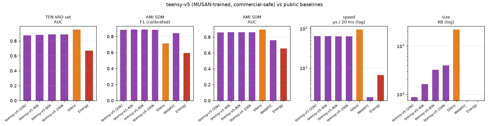

# teensy-vad-v5 — the commercial-safe retrain

**teensy-vad-v5** is the fifth generation of the TeensyVAD family: tiny
(20k–100k parameter) voice activity detectors for **8 kHz telephony audio**,
now trained with a **fully commercial-safe data pipeline** — the one thing
that kept v4 out of commercial deployments.

Same architecture and feature frontend as v4 (log-mel + deltas + 10-frame
context → 3-layer MLP, 25/25 ms window, 10 ms hop, 20 mel bands, 80–3800 Hz).
The only change is the training data: the environmental noise pool is
**MUSAN (CC BY 4.0)** instead of ESC-50 (CC BY-NC-SA 3.0), so the weights
carry **no non-commercial restriction**.

## Results (human-labelled real audio, same protocol as every prior family)

| model | params | KB | TEN F1* | TEN AUC | AMI F1 | AMI AUC | µs/20ms |
|---|---|---|---|---|---|---|---|
| teensy-v5 (20k) | 20,449 | 87 | 0.8953 | 0.8760 | 0.8836 | 0.8579 | 64 |
| teensy-v5-40k | 39,609 | 162 | 0.8963 | 0.8810 | **0.8853** | 0.8620 | 64 |
| **teensy-v5-80k** | 80,373 | 321 | **0.9016** | **0.8877** | 0.8845 | 0.8622 | 63 |
| teensy-v5-100k | 99,593 | 396 | 0.9008 | 0.8865 | 0.8823 | 0.8596 | 63 |
| Silero VAD (1.77M) | 1,774,000 | 2200 | 0.9381 | 0.9519 | 0.7136 | 0.8938 | 94 |
| WebRTC VAD | — | — | n/a | n/a | 0.8419 | 0.7602 | 2 |
| Energy VAD | — | — | — | 0.6702 | 0.5920 | 0.6578 | 7 |

\* TEN at best-F1 threshold (upper bound); AMI at AMI-dev-calibrated
thresholds, identical protocol for every system.

**Headlines**

- **TEN AUC 0.8877 (v5-80k) — new family record**, ahead of v4-80k (0.880)
  and FlashVAD v0.1 (0.882) at the same parameter count.
- **AMI F1 0.8853 (v5-40k)** is the best room-audio F1 of any teensy
  generation, at **half the size of v4-80k**.
- Speed unchanged: ~63–64 µs per 20 ms telephony chunk (single core).
- v5-80k is the recommended default; v5-40k is the size/accuracy sweet spot.



## Files

| file | use |
|---|---|
| `teensy-v5.npz` family (this repo: `-20k/-40k/-80k/-100k`) | numpy runtime (float32 weights + calibrated thresholds in metadata) |
| `teensy-v5-*.onnx` | ONNX float32 (other runtimes/languages) |
| `teensy-v5-*-int8.onnx` | ONNX dynamic int8 (22 KB for the 20k model) |

Quick start (numpy only):

```python
from teensyvad import StreamingVAD
vad = StreamingVAD("teensy-v5-80k.npz")
for frame in phone_frames:            # 20 ms PCM16LE @ 8 kHz
    for ev in vad.feed(frame):
        print(ev.t, ev.type)          # speech_start / speech_end
```

Thresholds ship inside the `.npz` metadata (`thr_hi`/`thr_lo`, calibrated on
AMI dev meetings; v5 converged on `thr_hi 0.10` — the distant-room profile).
For close-mic telephony, start at `thr_hi 0.45` as in prior generations.

## License & data

**Weights: CC BY 4.0** — commercial use, redistribution and derivatives
permitted with attribution (© 2026 Pankaj Doharey / Metacritical,
TeensyVAD by VoxLogic).

Training data is fully commercial-safe:

* Speech: LibriSpeech train-clean-100 (CC BY 4.0)
* Noise: MUSAN (CC BY 4.0) — replacing the ESC-50 CC BY-NC-SA noise of v3/v4
* Ambience: AMI room audio (CC BY 4.0), calibration meetings only
* Teacher labels: Silero VAD (MIT)
* Code: MIT

This is the same architecture and recipe as v4, with the noise pool swapped;
the generation is versioned separately so v4 (NC) and v5 (CC BY) lineages
remain unambiguous.

## Limitations

English speech; no music in training (music reads as activity); 100 ms
context (fricatives in noise remain the hardest frames); no AEC — use an
echo canceller upstream. Full details: family papers and INTEGRATION.md.

## Citation

```bibtex
@software{doharey2026teensyvadv5,
  title  = {TeensyVAD-v5: Commercial-Safe Voice Activity Detection
            for Telephony in 20k--100k Parameters},
  author = {Doharey, Pankaj},
  year   = {2026},
  url    = {https://huggingface.co/Teensy/teensy-vad-v5}
}
```
