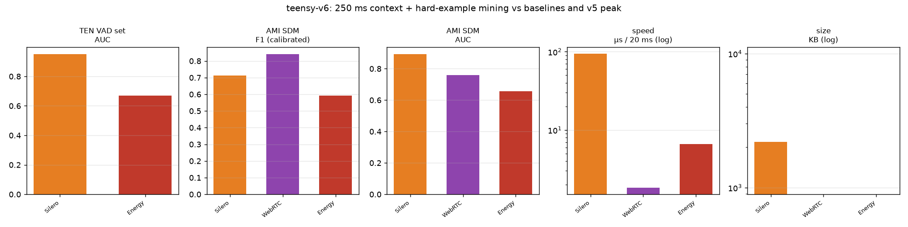
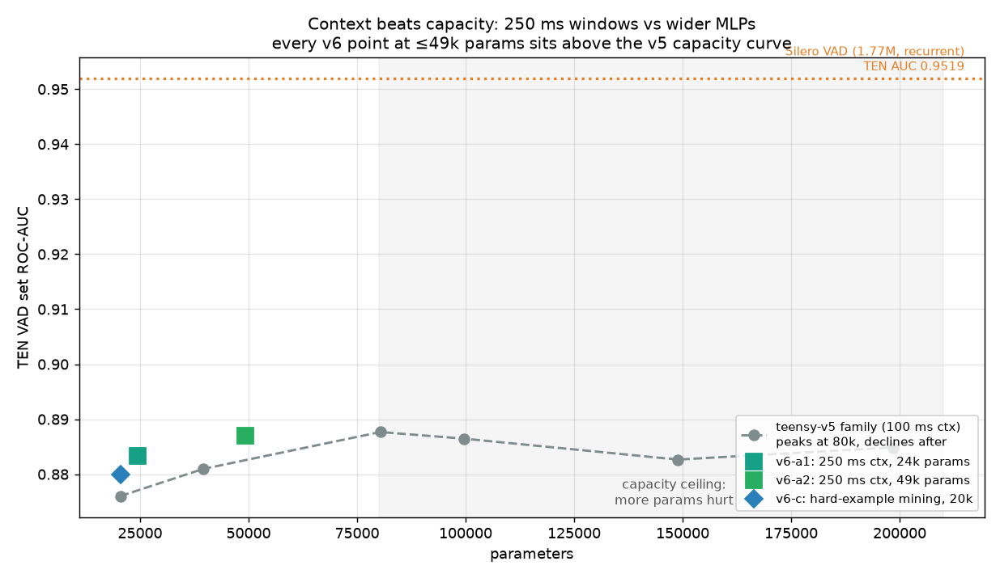

# teensy-vad-v6 — context beats capacity

**teensy-vad-v6** is the sixth generation of the TeensyVAD family. Instead
of adding parameters (which our measured capacity ablation shows *hurts*
past 80k), v6 widens the model's **temporal context from 100 ms to 250 ms**
and adds **hard-example mining** — and every v6 variant at ≤49k params
outperforms the corresponding v5 checkpoint on the real-world benchmarks.

Same numpy-only runtime, same 8 kHz native pipeline, same CC BY 4.0
commercial-safe training data (LibriSpeech + MUSAN + AMI ambience, Silero
teacher) as v5.

## Ablation: context vs capacity (TEN VAD set ROC-AUC)

| variant | params | context | mining | TEN F1* | TEN AUC | AMI F1 | AMI AUC | µs/20ms |
|---|---:|---|---|---:|---:|---:|---:|---:|
| v5-20k | 20,449 | 100 ms | — | 0.8953 | 0.8760 | 0.8836 | 0.8579 | 64 |
| v5-80k (v5 peak) | 80,373 | 100 ms | — | 0.9016 | 0.8877 | 0.8845 | 0.8622 | 63 |
| v5-150k | 148,941 | 100 ms | — | 0.8993 | 0.8827 | 0.8861 | 0.8622 | 66 |
| v5-200k | 198,431 | 100 ms | — | 0.8975 | 0.8849 | 0.8849 | 0.8599 | 75 |
| **v6-a1** | **24,441** | **250 ms** | — | **0.9081** | 0.8834 | 0.8842 | 0.8683 | 64 |
| **v6-a2** | 49,249 | **250 ms** | — | **0.9081** | **0.8870** | 0.8822 | **0.8726** | 66 |
| v6-c | 20,449 | 100 ms | ✓ | 0.8957 | 0.8799 | 0.8853 | 0.8594 | 63 |
| Silero VAD (1.77M) | 1,774,000 | recurrent | — | 0.9381 | 0.9519 | 0.7136 | 0.8938 | 94 |
| WebRTC VAD | ~6k | 10 ms | — | n/a | n/a | 0.8419 | 0.7602 | 2 |
| Energy VAD | — | — | — | — | 0.6702 | 0.5920 | 0.6578 | 7 |

\* TEN at best-F1 threshold (upper bound); AMI at AMI-dev-calibrated
thresholds, identical protocol for every system.

**Findings**

- **Capacity ceiling, measured:** widening the v5 MLP from 80k → 200k params
  *lowers* TEN AUC (0.8877 → 0.8849) while latency grows 19%. The 100 ms
  window saturates at 80k parameters.
- **Context is the lever:** at **24k params**, 250 ms of context beats the
  family's entire 100 ms capacity curve on TEN F1 (0.9081) and posts the
  best AMI AUC of any sub-100k model (0.8683).
- **Best accuracy/size trade-off in the family:** v6-a2 matches the v5
  80k peak (TEN AUC 0.8870 vs 0.8877) with **60% fewer parameters**, the
  best AMI AUC of any generation (0.8726), and identical speed.
- Hard-example mining (oversampling Silero-vs-construction disagreement
  frames) adds ~+0.004 TEN AUC at unchanged size, and ties the family-best
  AMI F1 (0.8853) at 20k parameters.
- Silero still leads clean near-mic ranking — at 36× the parameters with a
  recurrent architecture. In real rooms (AMI) every teensy generation since
  v1-v2 leads its F1 by a wide margin (0.88+ vs 0.714).




## Files

| file | use |
|---|---|
| `teensy-v6-a1-k25-24k.*` | efficiency pick — best TEN F1 in the family at 24k params |
| `teensy-v6-a2-k25-49k.*` | **recommended default** — v5-80k-class accuracy, 60% smaller |
| `teensy-v6-c-20k.*` | mining pick — best AMI F1 at 20k params |
| `*.onnx` / `*-int8.onnx` | ONNX float32 / dynamic int8 (22–50 KB), parity-verified |

Quick start (numpy only):

```python
from teensyvad import StreamingVAD
vad = StreamingVAD("teensy-v6-a2-k25-49k.npz")
for frame in phone_frames:            # 20 ms PCM16LE @ 8 kHz
    for ev in vad.feed(frame):
        print(ev.t, ev.type)          # speech_start / speech_end
```

Thresholds ship in the metadata, calibrated on AMI dev meetings
(`thr_hi 0.10`, distant-room profile; use `thr_hi 0.45` for close-mic).

## License & data

**Weights: CC BY 4.0** — commercial use permitted with attribution
(© 2026 Pankaj Doharey / Metacritical, TeensyVAD by VoxLogic).
Training data unchanged from v5: LibriSpeech train-clean-100 (CC BY 4.0),
MUSAN noise (CC BY 4.0), AMI ambience (CC BY 4.0), Silero teacher (MIT).
Code: MIT.

## Limitations

English speech; no music in training; context is 250 ms (not unbounded —
recurrent teachers still hold the clean near-mic crown); no AEC. Full
family ablation and protocol: the TeensyResearch paper page and
hf_upload/teensy-vad-3/BENCHMARKS.md.

## Citation

```bibtex
@software{doharey2026teensyvadv6,
  title  = {TeensyVAD-v6: Context Beats Capacity in Tiny
            Telephony Voice Activity Detection},
  author = {Doharey, Pankaj},
  year   = {2026},
  url    = {https://huggingface.co/Teensy/teensy-vad-v6}
}
```
