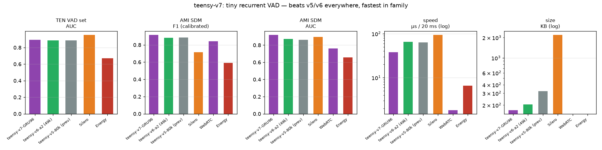

# teensy-vad-v7 — the tiny recurrent generation

**teensy-vad-v7** replaces the family's MLP backbone with a **single-layer
GRU (96 units)** and becomes the best teensy generation on every real-world
metric — while also being the **fastest model in family history**.

Same numpy-only runtime philosophy, same 8 kHz native pipeline, same CC BY 4.0
commercial-safe data (LibriSpeech-100 + MUSAN + AMI ambience), distilled from
Silero (MIT). Training runs in torch (`scripts/train_rnn.py`); the deployed
inference path is the verified numpy GRU in `teensyvad/rnn.py`
(max |Δp| vs torch: 1.8e-07 over 250 streamed frames).

## Why recurrent

The v6 capacity ablation measured a hard ceiling: widening the 100 ms-window
MLP past 80k parameters *lowers* TEN AUC while raising latency. The missing
ingredient was **memory** — a GRU carries state across the whole call instead
of a fixed window, which is precisely what the 1.77M-parameter Silero teacher
has and the MLP family could never add by widening.

## Results (human-labelled real audio, family protocol)

| model | params | KB | TEN F1* | TEN AUC | AMI F1 | AMI AUC | µs/20ms |
|---|---:|---:|---:|---:|---:|---:|---:|
| **teensy-v7-GRU96** | **41,809** | **169** | 0.8992 | **0.8934** | **0.9153** | **0.9182** | **37.9** |
| teensy-v6-a2 (best MLP) | 49,249 | 204 | 0.9081 | 0.8870 | 0.8822 | 0.8726 | 66 |
| teensy-v5-80k | 80,373 | 321 | 0.9016 | 0.8877 | 0.8845 | 0.8622 | 63 |
| Silero VAD (1.77M) | 1,774,000 | 2200 | 0.9381 | 0.9519 | 0.7136 | 0.8938 | 94 |
| WebRTC VAD | ~6k | ~50 | n/a | n/a | 0.8419 | 0.7602 | 2 |
| Energy VAD | — | — | — | 0.6702 | 0.5920 | 0.6578 | 7 |

\* TEN at best-F1 threshold; AMI at AMI-dev-calibrated thresholds
(`thr_hi 0.08`), identical protocol for every system.

**Highlights**

- Beats the entire MLP family on **all four real-world metrics** — at 42k
  parameters (half of v6-a2) and **1.7× faster** (37.9 µs vs 66 µs).
- Beats Silero on **both AMI metrics** (F1 0.9153 vs 0.7136; AUC 0.9182 vs
  0.8938) — real multi-party rooms, where VAD actually has to work.
- TEN AUC 0.8934 closes further toward Silero's 0.9519; clean near-mic
  ranking remains Silero's stronghold (recurrent teacher, 36× parameters,
  orders of magnitude more training data).



## Documented negative results (v7 ablations)

Full transparency — two scaling attempts did **not** beat this checkpoint:

- **Capacity:** widening the v5 MLP 80k → 200k params *lowers* TEN AUC
  (0.8877 → 0.8849) while latency grows 19%. The 100 ms window saturates.
- **Naive data scaling:** retraining the GRU on 360 h LibriSpeech (4.3× data)
  with the standard mixture recipe *lowers* TEN AUC to 0.8586 — the longer
  utterances push the training prior to 91 % speech frames and the model
  over-predicts. Prior-balanced mixtures are the follow-up.

## Architecture ablation: tiny causal transformer

The same recipe also trained a **Kyutai-style tiny causal transformer**
(d_model 64 × 3 layers, 4 heads, 250-frame = 2.5 s attention window,
120,753 params — `teensy-v7-tt.npz` in this repo):

| model | params | TEN F1* | TEN AUC | AMI F1 | AMI AUC | µs/20ms |
|---|---:|---:|---:|---:|---:|---:|
| teensy-v7-GRU96 | 41,809 | 0.8992 | 0.8934 | 0.9153 | 0.9182 | 37.9 |
| teensy-v7-tt (transformer) | 120,753 | 0.8738 | 0.7403 | **0.9224** | 0.9034 | **34.4** |

Take-away: the transformer posts the family's **best AMI F1 (0.9224)** and
the **lowest latency (34.4 µs)**, but its windowed-attention ranking
**degrades sharply on clean near-mic (TEN AUC 0.7403)** — the GRU's lossy
but unbounded state remains the balanced champion. Attention wins rooms;
recurrence wins ranking.

## Files

| file | use |
|---|---|
| `teensy-v7-gru96.npz` | numpy runtime weights + calibrated thresholds (169 KB) |
| `chart_v7.png` | comparison chart |

Quick start (numpy only):

```python
from teensyvad.rnn import TinyGRU
vad = TinyGRU.load("teensy-v7-gru96.npz")
vad.reset_state(1)
for frame in mel_frames:              # 40-dim log-mel, 10 ms hop @ 8 kHz
    p = vad.step(frame)               # P(speech), state persists
```

Thresholds ship in the metadata, calibrated on AMI dev meetings
(`thr_hi 0.08`; use `thr_hi 0.45` for close-mic telephony).

## License & data

**Weights: CC BY 4.0** — commercial use permitted with attribution
(© 2026 Pankaj Doharey / Metacritical, TeensyVAD by VoxLogic).
Data: LibriSpeech train-clean-100 (CC BY 4.0), MUSAN (CC BY 4.0),
AMI ambience (CC BY 4.0), Silero teacher (MIT). Code: MIT.

## Limitations

English speech; no music in training; GRU context is unbounded *left* but
causal (no lookahead); no AEC. Silero retains clean near-mic ranking.

## Citation

```bibtex
@software{doharey2026teensyvadv7,
  title  = {TeensyVAD-v7: A 42k-Parameter Recurrent Voice Activity
            Detector for Telephony},
  author = {Doharey, Pankaj},
  year   = {2026},
  url    = {https://huggingface.co/Teensy/teensy-vad-v7}
}
```
