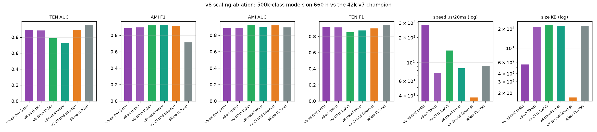

# teensy-vad-v8 — the 500k scaling ablation

**teensy-vad-v8** asks one question: does 10–14× the parameters and 6.6× the
training data beat the 42k-parameter v7 champion? **No — and the reasons are
the most useful result of the campaign.** Four ~500k-class models (3-layer
GRU-192, 4-layer causal transformer, 2-hidden MLP "a3", each distilled from
Silero on **660 hours** of prior-balanced mixtures) were trained with
quantization-aware fine-tuning and benchmarked on the family's calibrated
real-world protocol.

## Results (human-labelled real audio, calibrated protocol)

| model | params | KB | TEN F1 | TEN AUC | AMI F1 | AMI AUC | µs/20ms |
|---|---:|---:|---:|---:|---:|---:|---:|
| v8-GRU-192×3 | 582k | 2,285 | 0.8503 | 0.7843 | **0.9191** | **0.9227** | 138.8 |
| v8-transformer d128×4 | 570k | 2,229 | 0.8726 | 0.7255 | **0.9234** | 0.8969 | 84.7 |
| v8-a3 MLP (float) | 549k | 2,157 | 0.9122 | 0.8844 | 0.8949 | 0.8880 | 75.0 |
| **v8-a3 MLP (int8 QAT)** | 549k | **554** | **0.9133** | **0.8949** | 0.8852 | 0.8889 | 281.9* |
| **v7-GRU96 (champion)** | **42k** | **169** | 0.8992 | **0.8934** | 0.9153 | **0.9182** | **37.9** |
| Silero VAD (1.77M) | 1,774k | 2,200 | 0.9398 | 0.9514 | 0.7136 | 0.8938 | 90.2 |
| WebRTC VAD | ~6k | ~50 | n/a | n/a | 0.8419 | 0.7602 | 1.8 |

\* the numpy int8 matmul runtime is unoptimized; the int8 artifact itself is
**4× smaller** than float (554 KB vs 2.1 MB).



## Findings

1. **Scale did not beat fit.** No v8 model dominates the 42k v7 champion.
   The GRU-192 and transformer *do* edge it on AMI rooms (F1 0.919–0.923),
   but their clean near-mic ranking collapsed (TEN AUC 0.73–0.78 vs 0.89).
2. **The context-MLP scaled best.** a3-int8 matches v7's TEN AUC (0.8949 vs
   0.8934) with the family's best TEN F1 (0.9133) — at 13× its size.
3. **QAT won.** int8 fine-tuning *improved* TEN ranking over float
   (0.8844 → 0.8949) and held AMI. QAT is validated at 500k scale.
4. **Recurrence > attention at every tested scale** for clean-audio ranking.
5. **Under-training is the honest caveat:** the compute budget allowed only
   ~1.8 passes over 660 h (the deep models likely need 5+). Scale may still
   win — but only with proportional compute.

## Files

| file | use |
|---|---|
| `teensy-v8-gru192.npz` | 3-layer GRU-192, numpy runtime weights (2.2 MB) |
| `teensy-v8-tt.npz` | causal transformer d128×4 (2.2 MB) |
| `teensy-v8-a3.npz` | context-MLP a3, float (2.1 MB) |
| `teensy-v8-a3-qat.npz` | context-MLP a3, **int8 QAT** (554 KB) |
| `chart_v8.png` | comparison chart |

## License & data

**Weights: CC BY 4.0** — commercial use with attribution
(© 2026 Pankaj Doharey / Metacritical, TeensyVAD by VoxLogic).
Data: LibriSpeech 960 h train subsets (CC BY 4.0), MUSAN (CC BY 4.0),
AMI ambience (CC BY 4.0), Silero teacher (MIT). Code: MIT.

## Citation

```bibtex
@software{doharey2026teensyvadv8,
  title  = {TeensyVAD-v8: A 500k-Parameter Scaling Ablation for
            Tiny Voice Activity Detection},
  author = {Doharey, Pankaj},
  year   = {2026},
  url    = {https://huggingface.co/Teensy/teensy-vad-v8}
}
```
